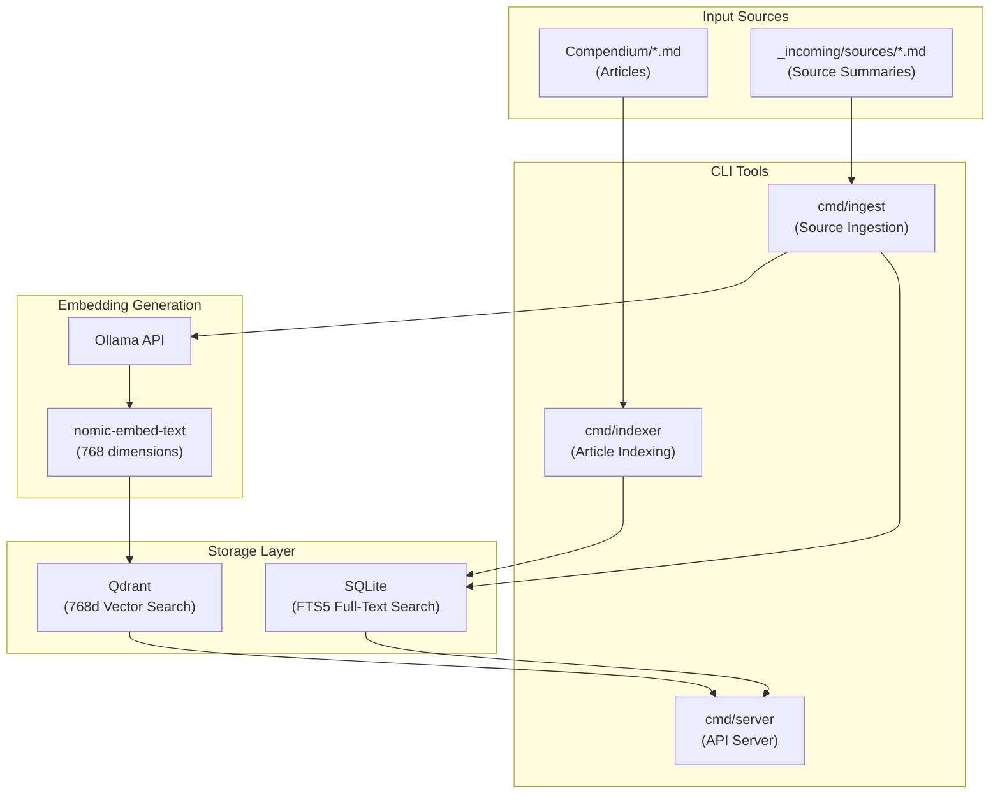
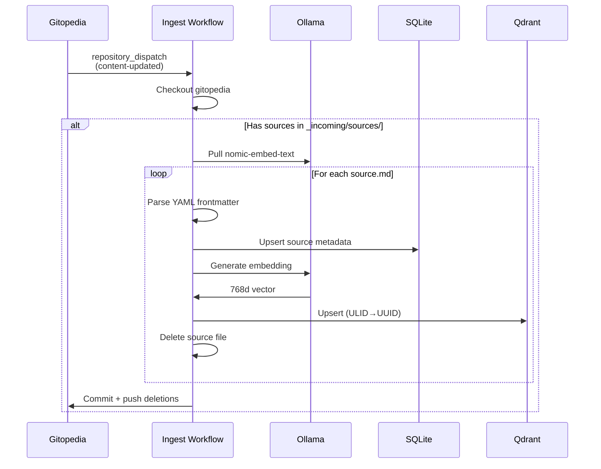

# Gitopedia Knowledge-Base

The Knowledge-Base maintains the search index and vector embeddings for the Gitopedia encyclopedia. It provides both full-text search (SQLite FTS5) and semantic search (Qdrant vector database) capabilities.

## Architecture



## Components

### Indexer (`cmd/indexer`)

Indexes articles from the Compendium into SQLite with full-text search.

```bash
# Basic usage
go run ./cmd/indexer -compendium ../gitopedia/Compendium -db out/knowledge.sqlite

# With embeddings (requires Ollama + Qdrant)
go run ./cmd/indexer \
  -compendium ../gitopedia/Compendium \
  -db out/knowledge.sqlite \
  -embeddings \
  -ollama-url http://localhost:11434 \
  -qdrant-host localhost \
  -qdrant-port 6334
```

### Ingest (`cmd/ingest`)

Ingests source summaries from `_incoming/sources/`, generates embeddings, and stores in both SQLite and Qdrant.

```bash
# Dry run (don't delete sources)
go run ./cmd/ingest \
  -sources ../gitopedia/Compendium/_incoming/sources \
  -db out/knowledge.sqlite

# With deletion (production)
go run ./cmd/ingest \
  -sources ../gitopedia/Compendium/_incoming/sources \
  -db out/knowledge.sqlite \
  -delete
```

### Server (`cmd/server`)

HTTP API server for querying the knowledge-base.

```bash
go run ./cmd/server -db out/knowledge.sqlite -port 8081
```

**Endpoints:**
- `POST /sources` - Store a new source
- `GET /sources/search?q=<query>&limit=10` - Search sources
- `GET /health` - Health check

## Database Schema

### SQLite Tables

```sql
-- Articles with full-text search
CREATE TABLE articles (
    id TEXT PRIMARY KEY,           -- ULID
    title TEXT NOT NULL,
    path TEXT NOT NULL,            -- e.g., "Science/Physics/quantum.md"
    author TEXT,
    summary TEXT,
    tags TEXT,                     -- JSON array
    meta_json TEXT                 -- Full frontmatter
);

CREATE VIRTUAL TABLE articles_fts USING fts5(
    title, summary, content,
    content=articles
);

-- Sources with full-text search
CREATE TABLE sources (
    id TEXT PRIMARY KEY,           -- ULID
    url TEXT UNIQUE,
    title TEXT,
    topic TEXT,                    -- Related article topic
    summary TEXT,
    language TEXT,
    model TEXT,                    -- LLM used for summarization
    created_at TEXT,
    tags TEXT                      -- JSON array
);

CREATE VIRTUAL TABLE sources_fts USING fts5(
    title, summary, content,
    content=sources
);
```

### Qdrant Collections

| Collection | Dimensions | Payload Fields |
|------------|------------|----------------|
| `sources` | 768 | id, url, title, topic, summary, language, model, created_at |
| `articles` | 768 | id, title, path, summary, tags, category |

**ULID to UUID Conversion:**

Qdrant requires UUID format for point IDs. The knowledge-base automatically converts ULIDs:

```
ULID:  01KBCVQXJS3QK3JCRGTWBFH2A6
UUID:  019ad9bb-f659-1de6-3933-10d716f88946
```

This conversion is lossless - both are 128-bit identifiers.

## Source Ingestion Pipeline



## CI/CD Workflows

### Build Index (`build-index.yml`)

Triggered on push to main or `content-updated` dispatch.

```yaml
- Checkout knowledge-base
- Checkout gitopedia
- Setup Go 1.23
- Run indexer
- Upload knowledge.sqlite artifact
```

### Ingest Sources (`ingest.yml`)

Triggered by `content-updated` dispatch from gitopedia.

```yaml
- Start Qdrant + Ollama services
- Generate GitHub App token
- Checkout gitopedia (with write access)
- Pull nomic-embed-text model
- Run ingest with -delete flag
- Commit and push source deletions to gitopedia
- Upload knowledge.sqlite artifact
```

## Local Development

### Prerequisites

```bash
# Start Qdrant
docker run -d --name qdrant -p 6333:6333 -p 6334:6334 qdrant/qdrant

# Start Ollama and pull embedding model
ollama serve &
ollama pull nomic-embed-text
```

### Running Locally

```bash
# Build all tools
go build ./...

# Index articles
./indexer -compendium ../gitopedia/Compendium -db out/knowledge.sqlite

# Ingest sources (dry run)
./ingest -sources ../gitopedia/Compendium/_incoming/sources -db out/knowledge.sqlite

# Start API server
./server -db out/knowledge.sqlite -port 8081
```

### Docker Compose

The researcher's `docker-compose.yml` includes Qdrant:

```yaml
services:
  qdrant:
    image: qdrant/qdrant:latest
    ports:
      - "6333:6333"  # REST API
      - "6334:6334"  # gRPC
```

## Project Structure

```
knowledge-base/
├── cmd/
│   ├── indexer/         # Article indexing CLI
│   ├── ingest/          # Source ingestion CLI
│   └── server/          # HTTP API server
├── internal/
│   ├── database/        # SQLite operations
│   ├── embedding/       # Ollama embedding client
│   └── vectordb/        # Qdrant client
├── .github/
│   └── workflows/
│       ├── build-index.yml
│       └── ingest.yml
├── out/                 # Output directory
│   └── knowledge.sqlite
└── go.mod
```

## API Reference

### Store Source

```bash
POST /sources
Content-Type: application/json

{
  "id": "01KBCVQXJS3QK3JCRGTWBFH2A6",
  "url": "https://example.com/article",
  "title": "Example Article",
  "topic": "quantum-mechanics",
  "summary": "Summary of the article...",
  "language": "en",
  "model": "qwen3:14b"
}
```

### Search Sources

```bash
GET /sources/search?q=quantum+physics&limit=10

Response:
{
  "results": [
    {
      "id": "01KBCVQXJS3QK3JCRGTWBFH2A6",
      "score": 0.95,
      "title": "Quantum Physics Overview",
      "url": "https://example.com/quantum"
    }
  ]
}
```

## Related Documentation

- [Main Architecture](../gitopedia/docs/architecture.md)
- [Integration Guide](../gitopedia/docs/integration.md)
- [Researcher Agent](../researcher/README.md)
